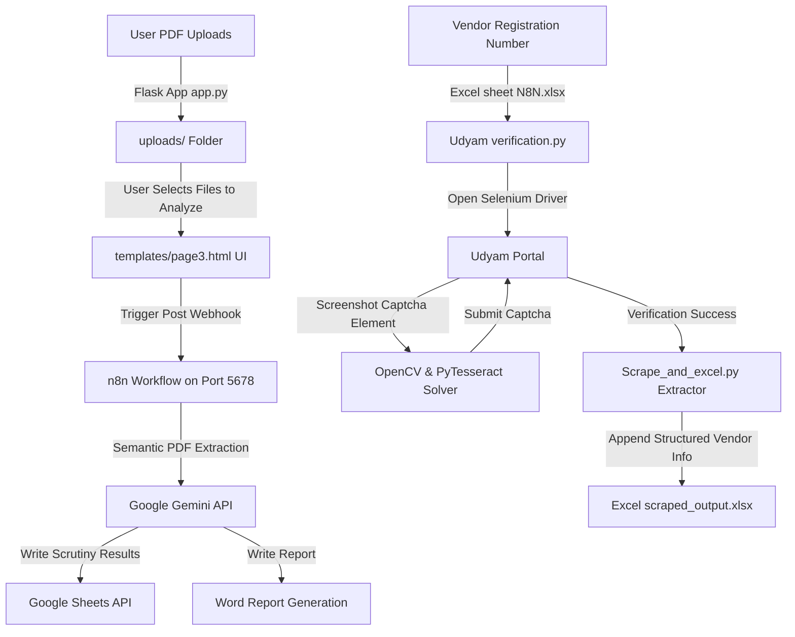

# SYSTEM BLUEPRINT & AI PROMPT: AI-driven Tender Scrutiny System for NLCI

If you are an AI assistant, read this document to immediately understand the project context, file structure, technology stack, detailed code architecture, and database/flow linkages. This blueprint acts as a comprehensive "context injection prompt" for you to begin debugging, enhancing, or explaining the codebase.

---

# PART 1: SYSTEM OVERVIEW & TECH STACK

This is an **AI-driven automation platform** developed for **NLC India Limited (NLCIL)** to automate industrial procurement tender evaluations (technical and financial bids). The system replaces manual, error-prone verification of PDF tenders by extracting, structuring, and verifying clauses against guidelines.

### Tech Stack:
- **Backend Framework**: Python (Flask)
- **Frontend Layer**: Semantic HTML5, CSS (Vanilla styling), JavaScript (dynamic progress bars, AJAX requests)
- **OCR and Image Processing**: OpenCV (`cv2`), Tesseract OCR (`pytesseract`), Pillow (`PIL`)
- **Web Automation/Scraping**: Selenium WebDriver, Webdriver Manager
- **Workflow Orchestration**: n8n (listens to local webhooks, manages data flow)
- **AI Core**: Google Gemini API (orchestrated via n8n for semantic extraction)
- **Data Warehousing / Storage**: Google Sheets API (for evaluation outputs), Pandas & openpyxl (for local Excel sheets)

---

# PART 2: REPOSITORY DIRECTORY TREE

```text
AI-driven-tender-scrutiny-system-for-NLCI/
├── Dockerfile.txt                          # Containerization instructions
├── README.md                               # Project documentation & impact summary
├── app.py                                  # Main Flask Web Server & routing logic
├── nlc.ico                                 # Favicon asset
├── suriya.bat                              # Windows automation batch script to launch n8n + Flask
├── uploads/                                # [DIR] Working directory for uploaded/merged PDFs
├── merged/                                 # [DIR] Temp folder for merging PDFs
├── static/                                 # [DIR] Frontend Assets
│   ├── bg-3.webp                           # Background image
│   ├── download.png                        # Download icon
│   ├── nlc.jpg                             # NLCIL logo image
│   ├── style1.css                          # CSS styles for Home (Page 1)
│   ├── style2.css                          # CSS styles for Merging/Upload (Page 2)
│   └── style3.css                          # CSS styles for Status/Evaluation (Page 3)
├── templates/                              # [DIR] HTML Views
│   ├── page1.html                          # Homepage & Credit View
│   ├── page2.html                          # PDF Upload & Merge Workspace
│   └── page3.html                          # Evaluation Control Panel & Webhook Trigger
└── Udyam Verification and Data Scrape/     # [DIR] Government Portal Automation Scripts
    ├── Scrape_and_excel.py                 # Selenium locators, scraping functions, Excel appender
    ├── Udyam verification.py               # Main Selenium orchestrator with CAPTCHA bypass
    ├── requirements.txt                    # Python library requirements for scraping
    └── tesseract-ocr-w64-setup-5.5.0...exe # Tesseract installer for OCR capability
```

---

# PART 3: DETAILED COMPONENT ARCHITECTURE & CORE CODE

### 1. Web Portal & File Manager (`app.py`)
Flask serves as the entry portal. It handles PDF file uploads, lists working files, processes multiple PDF mergers, and deletes or downloads workspace files.
- **Directories**:
  - `uploads/`: Active PDFs for evaluation. Cleared upon returning to home (`/`) or via `clear_merged_files`.
  - `merged/`: Short-lived temporary workspace used purely during `PdfMerger` operations.
- **Key Routes**:
  - `GET /` -> Clears uploads/merges and renders [page1.html](file:///c:/Users/acer/OneDrive/Desktop/AI-driven-tender-scrutiny-system-for-NLCI/templates/page1.html).
  - `POST /merge_option` -> Redirects user to `/merge` or `/workflow_status` (Note: `/workflow_status` renders a static template and serves as information, while [page3.html](file:///c:/Users/acer/OneDrive/Desktop/AI-driven-tender-scrutiny-system-for-NLCI/templates/page3.html) handles webhook execution).
  - `GET/POST /merge` -> Multi-file/single-file uploading. Uses `PyPDF2.PdfMerger` to bundle PDFs. Avoids overwriting by appending indices (e.g. `_1.pdf`). Renders [page2.html](file:///c:/Users/acer/OneDrive/Desktop/AI-driven-tender-scrutiny-system-for-NLCI/templates/page2.html).
  - `POST /clear_merged_files` -> Flushes all directories.
  - `GET/POST /evaluation` -> Lists PDFs in the upload folder, lets the user select evaluation parameters, and directs to evaluation actions in [page3.html](file:///c:/Users/acer/OneDrive/Desktop/AI-driven-tender-scrutiny-system-for-NLCI/templates/page3.html).
  - `GET /download/<filename>` & `POST/GET /delete_file/<filename>` -> Manages files in `uploads/` with secure filename safeguards to block path traversal.

### 2. Portal Captcha Bypassing & Scraping (`Udyam Verification and Data Scrape/`)
Automates verification of Udyam registration numbers (for MSME criteria compliance) on the official government website.

#### A. CAPTCHA Solving Pipeline (`Udyam verification.py`)
- **Input**: List of Udyam numbers extracted from a local Excel file (`C:/Users/syles/Documents/NLC/N8N.xlsx`) under the column `udyam registration`.
- **Portal URL**: `https://udyamregistration.gov.in/Government-India/Ministry-MSME-registration.htm`
- **Steps**:
  1. Opens Chrome using Selenium WebDriver.
  2. Hovers over "Print/Verify" menu -> Clicks "Udyam Verification".
  3. Locates username field and inputs the registration number.
  4. Takes a screenshot of the CAPTCHA image element (`screenshot_as_png`).
  5. **Preprocesses captcha image using OpenCV**:
     - Gray-scale conversion.
     - Binary inversion thresholding (`cv2.threshold(..., 150, 255, cv2.THRESH_BINARY_INV)`).
     - Morphological Closing (`cv2.morphologyEx`) with a 2x2 rectangular kernel to bridge character gaps and eliminate speckle noise.
     - Upscales the image 3x (`cv2.resize` with cubic interpolation) to enhance Tesseract's parsing structure.
  6. **OCR Extraction**: Passes processed image to `pytesseract` with configuration whitelisting alphanumeric values:
     `--psm 8 --oem 3 -c tessedit_char_whitelist=ABCDEFGHIJKLMNOPQRSTUVWXYZ0123456789`
  7. **Form Submission**: Enters the decoded CAPTCHA string and clicks submit.
  8. **Retry Mechanics**: Re-attempts up to 50 times in case of incorrect CAPTCHA reads.
  9. **Scraping**: Once verification succeeds, delegates data extraction to `Scrape_and_excel.py`.

#### B. Scraping & Excel Writing (`Scrape_and_excel.py`)
- **LOCATORS**: Holds a dictionary of hardcoded XPath queries mapped to key enterprise information, including:
  - Enterprise Name
  - Udyam Registration Number
  - Major Activity Type (Services/Manufacturing)
  - Classification Years & Enterprise Types (Micro, Small, Medium)
  - NIC 2/4/6 Digit Codes, activities, and operational dates (Indices 1 to 5).
- **Execution Flow**: Scrapes elements, maps text contents into a dictionary, checks if an Excel file exists at `C:/Users/syles/Documents/NLC/scraped_output.xlsx`, merges findings with existing records using Pandas, and outputs via openpyxl.

### 3. Workflow Orchestration Layer (n8n & Webhooks)
Triggered inside [page3.html](file:///c:/Users/acer/OneDrive/Desktop/AI-driven-tender-scrutiny-system-for-NLCI/templates/page3.html) using JavaScript AJAX fetch calls:
- **Evaluation Workflow Webhook**: Sends active file names list to n8n webhook at `http://localhost:5678/webhook/93f97adb-c532-44d9-9942-da74472c8cb6`. n8n coordinates reading the PDF, running semantic queries through the Google Gemini API (validating Earnest Money Deposits and Pre-Qualification Requirements), outputting records to a Google Sheet (`https://docs.google.com/spreadsheets/d/1wkYCypcvEWqS1Uz-zOfoIpR9gdNjDoktTm50jc-eTL0/edit`), and generating automated Word reports.
- **Udyam Webhook**: Triggers the Udyam Selenium robot at `http://localhost:5678/webhook/YOUR_UDYAM_WEBHOOK_ID`.

### 4. Deployments and Scripts
- **[Dockerfile.txt](file:///c:/Users/acer/OneDrive/Desktop/AI-driven-tender-scrutiny-system-for-NLCI/Dockerfile.txt)**: Minimal image configured on `python:3.10-slim`. Installs local dependencies via pip and starts `app.py` listening on port 5000.
- **[suriya.bat](file:///c:/Users/acer/OneDrive/Desktop/AI-driven-tender-scrutiny-system-for-NLCI/suriya.bat)**: Automates starting local services. Fires n8n backend CLI (`n8n.cmd`) and runs Flask backend in the background using `pythonw.exe`. Executes a PowerShell script checking for port 5000 activation before opening the default browser.

---

# PART 4: DATAFLOW PIPELINE



---

# PART 5: COGNITIVE OVERHEAD, HARDCODINGS, AND ARCHITECTURAL ISSUES

If you are modifying this codebase, watch out for the following:
1. **Hardcoded Windows Absolute Paths**:
   - `Udyam verification.py` uses:
     - `file_path = r"C:/Users/syles/Documents/NLC/N8N.xlsx"`
     - `EXCEL_PATH = r"C:/Users/syles/Documents/NLC/scraped_output.xlsx"`
   - `Scrape_and_excel.py` uses:
     - `EXCEL_PATH = r"C:/Users/syles/Documents/NLC/scraped_output.xlsx"`
   - `suriya.bat` uses:
     - `SET PROJECT_DIR=D:\Project\NLCIL-2\file_merge_app`
   *These paths must be modified to use environment variables or relative configurations (`os.path`) for multi-device runs.*
2. **Missing Template / Router Mismatch**:
   - In `app.py`, route `/workflow_status` redirects to `render_template("workflow_status.html")`. However, `workflow_status.html` does not exist in the `/templates` folder. The actual status controls (webhook, timer, progress) are implemented in `page3.html` (which has `<title>Workflow Status</title>`). Be careful if directing flow to `/workflow_status` as it will fail unless a template is placed or routed to `page3.html`.
3. **Implicit Dependency Mismatch**:
   - The root directory does not contain a `requirements.txt` file, which is called for execution by `Dockerfile.txt` (`RUN pip install -r requirements.txt`). However, there is a `requirements.txt` inside the `Udyam Verification and Data Scrape` folder. A standard application `requirements.txt` listing Flask, PyPDF2, Werkzeug, etc., needs to be placed in the root directory for Docker containers to build properly.
4. **Local Webhook Endpoints**:
   - In [page3.html](file:///c:/Users/acer/OneDrive/Desktop/AI-driven-tender-scrutiny-system-for-NLCI/templates/page3.html), the server calls `http://localhost:5678/webhook/...`. If deploying the frontend, this URL should be configurable to handle non-localhost endpoints.
